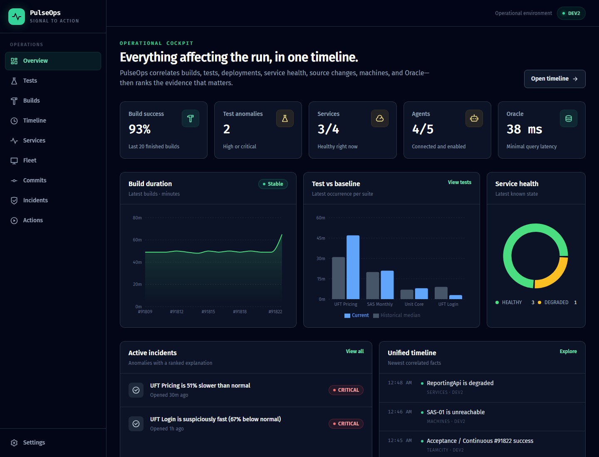
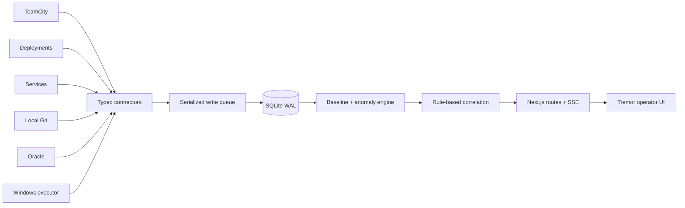

# PulseOps

[](https://github.com/Nielk74/pulseops/actions/workflows/ci.yml)

PulseOps is an internal engineering operations application that correlates CI
builds, tests, deployments, service health, source changes, Windows machines,
and Oracle probes. It detects abnormal runs and presents a ranked,
evidence-backed explanation without requiring an AI model.



## What is implemented

- Next.js 16 App Router with TypeScript and React 19
- Tremor Raw-style dashboard blocks, Tailwind CSS, TanStack Table, and Recharts
- SQLite in WAL mode with an explicit 20-table Drizzle schema and migrations
- TeamCity builds, artifacts, test occurrences, and agents
- Deployment Info API normalization
- Services Status API snapshots and Grafana deep links
- safe local Git ingestion using argument arrays, never shell interpolation
- lightweight Oracle connectivity, minimal SQL, and representative probes
- Windows machine health, Chocolatey inventory, allow-listed environment values,
  and reference-machine drift
- a single Fleet operations workspace with selectable machine cards, progressive
  health and inventory detail, contextual actions, and per-machine audit history
- median/MAD slow-test detection and suspiciously fast-run detection
- deterministic evidence scoring across services, Oracle, machines,
  deployments, commits, and test discovery
- unified events, incidents, data freshness, polling health, and optional SSE
- strongly typed, role-checked, plan-first operational actions with audit records
- independent live/mock selection for every external source

The implementation follows the V1 scope in
[pulseops-technical-plan.md](pulseops-technical-plan.md). Mutation-heavy fleet
actions remain plan-only until the trusted Windows executor workflow is enabled.

## Quick start

Requirements: Node.js 22 or newer and npm.

```bash
npm install
npm run db:migrate
npm run db:seed
npm run dev
```

Open [http://localhost:3000](http://localhost:3000). Development defaults to
all mocked sources when no mock variables are specified, so the application is
useful immediately without internal-system access.

To make the mode explicit:

```bash
cp .env.example .env.local
```

PowerShell equivalent:

```powershell
Copy-Item .env.example .env.local
```

## Mock every source independently

`MOCK_ALL=true` selects every mock. With `MOCK_ALL=false`, each source can be
selected independently:

| Source | Switch | Mock includes |
|---|---|---|
| TeamCity | `MOCK_TEAMCITY` | builds, artifacts, tests, agents |
| Deployments | `MOCK_DEPLOYMENTS` | deployments and stage history |
| Services | `MOCK_SERVICES` | health, latency, errors, Grafana links |
| Git | `MOCK_GIT` | commits and changed files |
| Oracle | `MOCK_ORACLE` | connection, minimal query, app probe |
| Machines | `MOCK_MACHINES` | health, packages, environment inventory |

Example mixed mode:

```dotenv
MOCK_ALL=false
MOCK_TEAMCITY=true
MOCK_DEPLOYMENTS=false
MOCK_SERVICES=true
MOCK_GIT=false
MOCK_ORACLE=true
MOCK_MACHINES=true
```

Mock and live connectors produce the same domain types and pass through the
same idempotent ingestion, anomaly, and correlation pipeline.

## Live connector configuration

Copy `.env.example`, set the desired source mock switch to `false`, and provide
its configuration:

- TeamCity: `TEAMCITY_BASE_URL`, `TEAMCITY_TOKEN`
- deployments: `DEPLOYMENTS_API_URL`, optionally `DEPLOYMENTS_API_TOKEN`
- services: `SERVICES_API_URL`, optionally `SERVICES_API_TOKEN`
- Git: `GIT_REPOSITORY_PATH`, `GIT_REMOTE`, `GIT_BRANCH`
- Oracle: `ORACLE_CONNECT_STRING`, `ORACLE_USERNAME`, `ORACLE_PASSWORD`, and
  optionally `ORACLE_APPLICATION_QUERY`
- machines: `WINDOWS_EXECUTOR_URL`, optionally `WINDOWS_EXECUTOR_TOKEN`

Secrets are read from the environment and never stored in SQLite. A source that
is missing required configuration is marked `UNCONFIGURED`; stale or failed
telemetry is never shown as current healthy data.

## Architecture



See [docs/ARCHITECTURE.md](docs/ARCHITECTURE.md) for connector contracts,
storage boundaries, polling behavior, evidence scoring, and action security.

## Useful commands

| Command | Purpose |
|---|---|
| `npm run dev` | run the development server |
| `npm run build` | create a production build |
| `npm run db:generate` | generate a migration from the Drizzle schema |
| `npm run db:migrate` | apply checked-in migrations |
| `npm run db:seed` | ingest deterministic mock data |
| `npm run db:check` | verify that all core datasets are populated |
| `npm run sync` | run every connector once |
| `npm run lint` | run ESLint |
| `npm run typecheck` | run strict TypeScript checking |
| `npm test` | run anomaly and correlation unit tests |
| `npm run test:e2e` | run desktop/mobile Playwright smoke tests |

## API surface

The route handlers implement the plan's resource layout:

- overview, incidents, timeline, connector health, and SSE
- builds, build tests, and build explanations
- tests, test history, and occurrence explanations
- services and service history
- machines, packages, environment inventory, and drift
- commits and changed files
- action planning, execution, and audit detail

Health/readiness is available at `GET /api/health`.

## Polling and retention

Set `ENABLE_POLLING=true` to start the in-process scheduler. Every interval is
configurable in `.env.example`. External fetches can overlap, while SQLite
writes pass through one short write queue. External identifiers are used as
upsert keys, making connector execution safe to repeat.

Suggested sample retention from the plan remains configuration/deployment
policy; builds, deployments, commits, and action audits are retained
indefinitely by default.

## Authentication and actions

PulseOps understands `VIEWER`, `OPERATOR`, and `ADMIN`. In production, a trusted
OIDC/SSO proxy can inject identity headers only after `AUTH_TRUSTED_PROXY=true`
is explicitly set. Untrusted caller headers are otherwise ignored.

The browser never accepts arbitrary PowerShell or command text. V1 executes only
read-only diagnostic refresh actions. TeamCity mutations, service operations,
Chocolatey changes, and environment synchronization can be planned and audited,
but are intentionally not executable until the separate trusted executor is
configured.

## Container run

```bash
docker compose up --build
```

The compose profile uses all mocks and a persistent SQLite volume. The image can
be configured for live sources entirely through environment variables.

## Project records

- [Implementation progress](PROGRESS.md)
- [Technical plan](pulseops-technical-plan.md)
- [Persisted design system](design-system/pulseops/MASTER.md)
- [Fleet workspace design rules](design-system/pulseops/pages/fleet.md)
- [Security model](SECURITY.md)
- [Contributing](CONTRIBUTING.md)

Released under the [MIT License](LICENSE).
